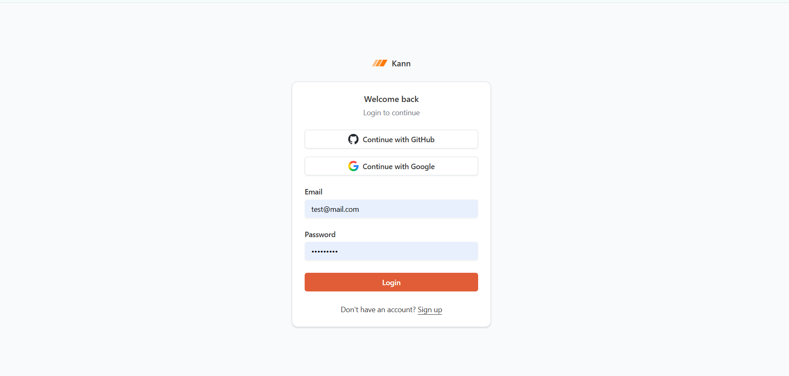
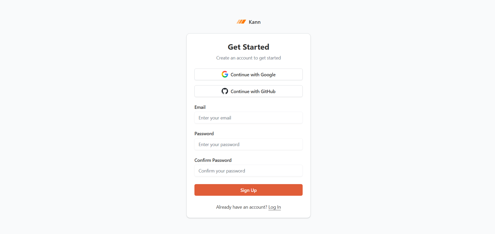
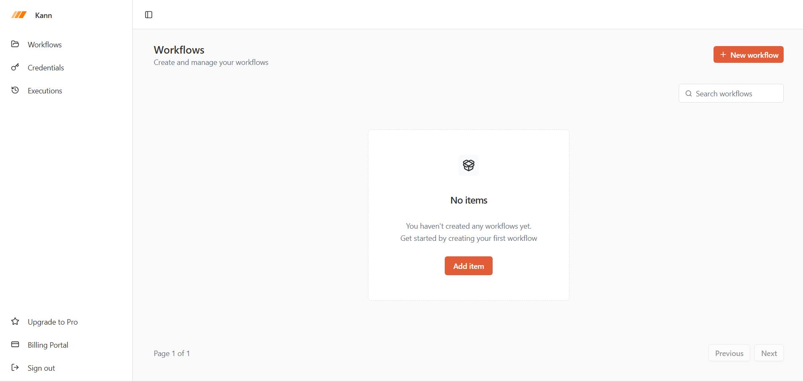
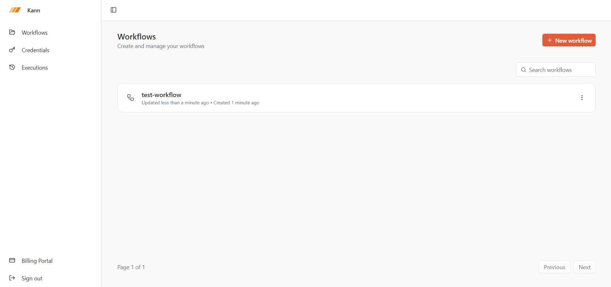
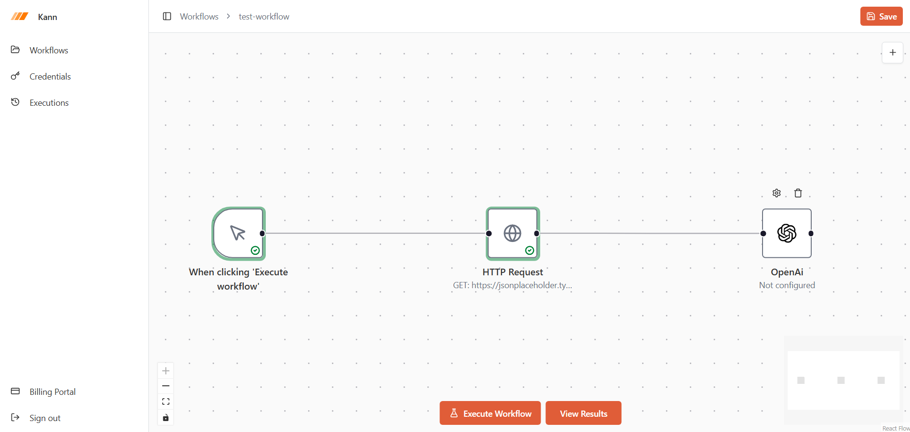
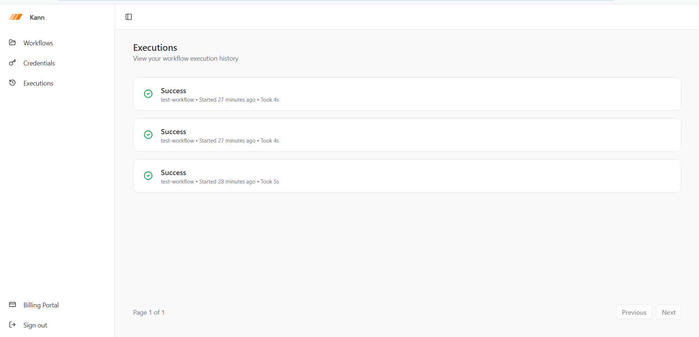
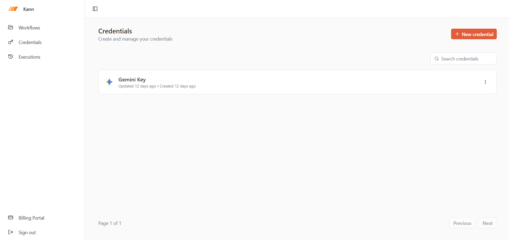
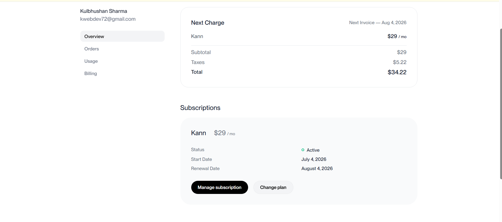

# 🚀 Kann – AI Workflow Automation Platform

> Build AI-powered workflows visually using drag-and-drop automation.

Kann is a modern workflow automation platform which explores the architecture behind workflow automation platforms such as Zapier and n8n. It allows users to visually build workflows that react to events, execute AI tasks, make HTTP requests, and automate repetitive business processes.

The project was built to demonstrate production-ready full-stack engineering SaaS using Next.js 15, React 19, Better Auth, Prisma, PostgreSQL, Inngest, and modern AI SDKs.

---

Why Kann?

Something like:

Modern businesses rely on dozens of SaaS applications. Connecting these systems often requires repetitive manual work or expensive automation platforms. Kann explores how such a workflow automation platform can be designed using modern web technologies, event-driven execution, and AI integrations.

# ✨ Features

## Authentication

- Email & Password Authentication
- GitHub OAuth
- Google OAuth
- Secure session management using Better Auth
- OAuth account linking
- Protected routes

---

## Visual Workflow Builder

- Drag & Drop workflow editor
- React Flow powered canvas
- Persistent workflow storage
- Auto-saving workflows
- Workflow execution history

---

## AI Nodes

Generate AI responses using multiple providers.

Supported providers:

- OpenAI
- Gemini
- Anthropic Claude

Switch AI providers without changing workflow logic.

---

## Triggers

Current supported triggers:

- Manual Trigger
- Form Submission Trigger
- Stripe Webhook Trigger

---

## Actions

- HTTP Request
- Generate Text (OpenAI)
- Generate Text (Gemini)
- Generate Text (Anthropic)

---

## Billing

Integrated with Polar.

Features include:

- Customer creation
- Subscription management
- Billing Portal
- Premium feature upgrading

---

## 🌐 Live Demo

Coming Soon

## 📚 Case Study

Read the complete engineering journey in [CASE_STUDY.md](CASE_STUDY.md)

## 💻 Source Code

Browse the project on GitHub. https://github.com/Kwebdev1234/Kann

# 📸 Screenshots

## Login


Secure authentication with Email/Password, GitHub OAuth, and Google OAuth.

---

## Sign Up



---

## Dashboard (Free Plan)



Manage workflows, credentials, and executions from a centralized dashboard. Free users can upgrade to unlock premium capabilities.

---

## Dashboard (Pro Plan)



## Premium dashboard after subscription activation, with access to billing management and advanced features.

## Workflow Builder


Visual drag-and-drop editor powered by React Flow for designing automation.

---

## Workflow Executions


Track workflow execution history with timestamps, duration, and execution status.

---

## Credentials Management


Securely store and manage API credentials used by workflow nodes.

---

## Billing Portal


Integrated subscription management powered by Polar, allowing users to upgrade, manage plans, and view invoices.

## Production Features

- Error Boundaries
- Suspense Loading
- Route Prefetching
- React Query Caching
- Server Components
- Optimistic UI
- Type-safe APIs with tRPC
- Runtime validation using Zod

---

# 🛠 Tech Stack

## Frontend

- Next.js 15
- React 19
- TypeScript
- Tailwind CSS
- React Flow
- React Hook Form
- TanStack Query
- Shadcn UI

## Backend

- tRPC
- Better Auth
- Prisma ORM
- PostgreSQL
- Inngest

## AI

- OpenAI
- Gemini
- Anthropic

## Integrations

- Stripe Webhooks
- Polar Billing
- Sentry

---

# 🏗 Architecture

```
User

   │

   ▼

Next.js App Router

   │

   ▼

tRPC API Layer

   │

   ▼

Workflow Engine

   │

   ├── AI Providers
   │
   ├── HTTP Requests
   │
   ├── Stripe Webhooks
   │
   └── Inngest Background Jobs

   │

   ▼

PostgreSQL
```

---

# ⚡ Engineering Challenges Solved

During development I encountered and solved several production-level engineering problems including:

- OAuth authentication race conditions
- Session synchronization issues
- Billing synchronization with Polar
- Route loading optimization
- React Query caching strategies
- Long-running background execution handling
- Error recovery for failed workflow executions

These challenges and their solutions are documented in the accompanying CASE_STUDY.md.

---

# 🚀 Local Setup

```bash
git clone <repo>

npm install

npm run dev
```

Configure:

```
DATABASE_URL

BETTER_AUTH_SECRET

BETTER_AUTH_URL

GITHUB_CLIENT_ID

GITHUB_CLIENT_SECRET

GOOGLE_CLIENT_ID

GOOGLE_CLIENT_SECRET

OPENAI_API_KEY

GOOGLE_GENERATIVE_AI_API_KEY

ANTHROPIC_API_KEY

POLAR_ACCESS_TOKEN

STRIPE_SECRET_KEY
```

Run Prisma

```bash
npx prisma generate

npx prisma db push
```

---

# 📸 Screenshots

- Login
- Dashboard
- Workflow Builder
- Workflow Execution
- Credentials
- Billing

---

# 📚 Future Roadmap

Planned improvements include:

- Gmail Trigger
- Slack Integration
- Discord Integration
- Scheduled (Cron) Workflows
- Email Actions
- WhatsApp Actions
- Retry Policies
- Parallel Execution
- Conditional Branching
- Workflow Templates

---

# 👨‍💻 About

Built by **Kulbhushan Sharma**
React • TypeScript • Next.js • Full Stack Engineering

If you found this project interesting, feel free to connect or provide feedback.
